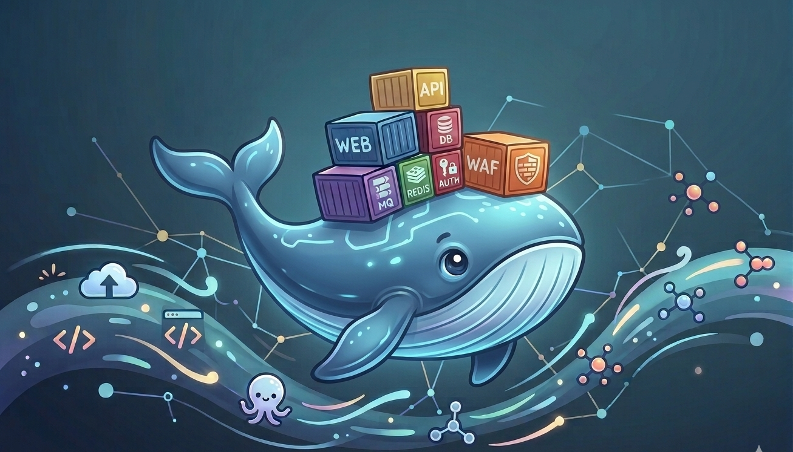

<h1 align="center">Diving Into Docker 🐳</h1>

  

Hands-on lab documentation covering Docker fundamentals 
from the ground up. Every concept practiced in a real 
terminal environment, documented publicly, and connected to how Docker is actually used in production cloud environments.

Containerization is the standard way production applications 
are deployed, scaled, and managed in modern cloud 
infrastructure. Engineers who understand Docker do not just 
run containers. They understand why containers exist, what 
problems they solve for the business, and how they connect 
to the broader cloud engineering stack. That understanding 
is what this repo is built around.

---

## What's Covered

- Core Docker concepts: images, containers, and the 
  relationship between them
- Running and managing containers with docker run
- Building and managing Docker images
- Environment variables and runtime configuration
- CMD vs ENTRYPOINT and controlling container behavior
- Docker Compose for multi-container applications
- Docker storage: volumes and persistent data
- Docker registries and pushing images to Amazon ECR
- Docker networking: bridge, host, and overlay networks
- Container orchestration concepts: Kubernetes and ECS

---

## Labs

| Lab | Topic | Status |
|---|---|---|
| [Lab 01 — Basic Docker Commands](labs/lab-01-basic-docker-commands.md) | docker run, docker ps, docker stop, docker rm, docker images | ✅ Complete  |
| [Lab 02 — Docker Run](labs/lab-02-docker-run.md) | Image tags, Port mapping, volume mounting, interactive mode | ✅ Complete |
| [Lab 03 — Docker Images](labs/lab-03-docker-images.md) | Dockerfile, building images, tagging, layering, docker build | ✅ Complete |
| [Lab 04 — Environment Variables](labs/lab-04-environment-variables.md) | Passing env vars at runtime, inspecting containers, config management | 📋 Planned |
| [Lab 05 — CMD vs ENTRYPOINT](labs/lab-05-cmd-vs-entrypoint.md) | Default commands, overriding behavior, combining CMD and ENTRYPOINT | 📋 Planned |
| [Lab 06 — Docker Compose](labs/lab-06-docker-compose.md) | Multi-container apps, docker-compose.yml, networking between services | 📋 Planned |
| [Lab 07 — Docker Storage](labs/lab-07-docker-storage.md) | Volumes, bind mounts, persistent data, storage drivers | 📋 Planned |
| [Lab 08 — Docker Registry](labs/lab-08-docker-registry.md) | Docker Hub, Amazon ECR, pushing and pulling images, authentication | 📋 Planned |
| [Lab 09 — Docker Networking](labs/lab-09-docker-networking.md) | Bridge networks, host networking, container DNS, network isolation | 📋 Planned |
| [Lab 10 — Container Orchestration](labs/lab-10-container-orchestration.md) | Kubernetes fundamentals, ECS and EKS on AWS, scaling containers | 📋 Planned |

---

## Why This Matters In Production

Docker is not a standalone skill. Every concept in this repo 
connects directly to how production cloud infrastructure is 
built and operated. Docker Registry is how images get stored 
and versioned before deployment. On AWS that is Amazon ECR. 
Docker Networking is how containers communicate securely. 
On AWS that maps to ECS task networking and security group 
configuration. Container Orchestration is how containers are 
scaled and managed at production load. On AWS that is both ECS 
and EKS.

Learning Docker without that context is learning half the 
skill. This repo documents both.

---

## Environment

Local Mac terminal and KodeKloud hands-on lab environment  
AWS integration: Amazon ECR, Amazon ECS, Amazon Linux 2023
