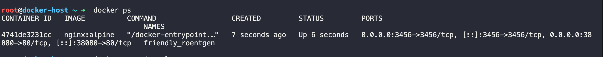
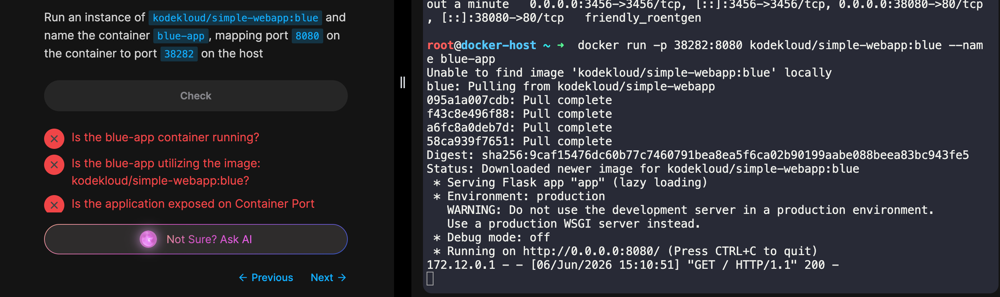

# Lab 02 — Docker Run

## What This Lab Covers

This lab goes deeper into `docker run` which is the command introduced in Lab 01 that does a lot more than just start a container. Here it is used to control which version of an image runs, how a container handles input, how traffic reaches it from a browser, and how its data survives after the container is removed.

These are the concepts that make Docker practical rather than just functional. Knowing how to start a container is one thing. Knowing how to reach it, interact with it, and make sure its data does not disappear is what makes it usable in a real environment.

This lab covers image tags, the `-i` and `-t` flags, the `-p` flag for port mapping, and the `-v` flag and `--mount` option for volume mounting.

---

## Before the Commands: What You Need to Know

**Tags and versioning**

Every image on Docker Hub can have multiple versions and each version is identified by a tag. When you run `docker run redis`, Docker pulls the image with the `latest` tag by default. The `latest` tag always points to the most recent version of that software as determined by the people who maintain it.

To run a specific version, add a colon and the tag after the image name.

    docker run redis:7.4

Each tagged version is stored as a separate image on your machine. Running `docker images` will show them as separate entries with the same repository name but different tags.

The `latest` tag is convenient for experimenting but should not be used in production. It is a moving target. The day you redeploy, the maintainers may have pushed a new version and your container quietly upgrades, sometimes with breaking changes. Pinning to a specific tag means you always get the same image and you decide when to upgrade.

**How containers connect to the outside world**

Every Docker container gets its own internal IP address assigned automatically. This IP is only accessible from within the Docker host, the machine running Docker. It is not reachable from a browser on another machine or from the internet.

The Docker host itself has its own IP address that is reachable from outside. To make a containerized application accessible, you have to connect a port on the Docker host to a port inside the container. This is called port mapping.

**Why container data does not persist by default**

A Docker container has its own isolated filesystem. Any files created or modified inside the container live there and nowhere else. When the container is deleted, everything inside it is deleted with it, including any data your application wrote to disk.

To keep data after a container is removed, you map a folder on your host machine to a folder inside the container. Anything the container writes to that folder gets written to your host machine instead, where it survives the container being deleted.

---

## Commands Covered

**Running a container with a specific tag**

Add a colon and the tag after the image name to pull and run a specific version.

    docker run redis:7.4
    docker run nginx:1.25.3

If no tag is specified Docker uses `latest` automatically. To find available tags for any image, look it up on [hub.docker.com](https://hub.docker.com) and check its Tags section.

To remove a specific tagged image you no longer need, use the exact tag with `docker rmi`.

    docker rmi redis:7.4

This removes only that version and leaves any other versions on your machine untouched.

---

**`-i` (interactive)**

By default a Docker container does not listen for any input from your keyboard. The `-i` flag connects your keyboard input to the container so it can receive what you type.

    docker run -i my-app

Use `-i` alone when you are feeding data into a container through a pipeline rather than typing into it directly. Adding `-t` in that situation would cause an error because pipelines are not terminals.

---

**`-t` (terminal)**

The `-t` flag gives the container a terminal interface. Programs use this to decide whether to display things like color output, progress bars, and formatted prompts. Without it those visual elements do not appear even if the program supports them.

    docker run -t my-app

Use `-t` alone when you want formatted output from a container but are not sending any input to it.

---

**`-it` (interactive terminal)**

In most cases `-i` and `-t` are used together. `-i` lets you type into the container and `-t` gives it a terminal so prompts and formatting display correctly. Together they make the container feel like a normal interactive session.

    docker run -it ubuntu bash

These flags work the same way in `docker exec` when you need to open a live session inside a container that is already running, which was covered in Lab 01.

---

**`-p` (port mapping)**

The `-p` flag maps a port on your Docker host to a port inside the container. This is what makes a containerized application reachable from a browser or from outside the host machine.

The syntax is always host port first, container port second, separated by a colon.

    docker run -p 80:5000 my-web-app

In this example, any traffic hitting port 80 on your host gets routed to port 5000 inside the container. From a browser you would go to the host machine's IP on port 80.

You can run multiple containers and map them to different ports on the same host.

    docker run -p 3306:3306 mysql
    docker run -p 8306:3306 mysql

You cannot map two containers to the same host port. Each port on the host can only point to one destination at a time.

---

**`-v` (volume mounting)**

The `-v` flag maps a folder on your host machine to a folder inside the container. Anything the container writes to that folder gets stored on your host instead of inside the container, so it survives the container being deleted.

The syntax is host path first, container path second, separated by a colon.

    docker run -v /opt/data:/var/lib/mysql mysql

In this example, any data MySQL writes to `/var/lib/mysql` inside the container is actually being written to `/opt/data` on your host. Delete the container and the data is still there.

---

**`--mount` (explicit volume mounting)**

`--mount` is the more modern way to write the same thing. Instead of a single colon separated string it uses key value pairs that make the intent clearer.

    docker run --mount type=bind,source=/opt/data,target=/var/lib/mysql mysql

`type=bind` specifies this is a bind mount, meaning a direct connection between a folder on your host and a folder inside the container. `source` is the path on your host. `target` is the path inside the container.

Both `-v` and `--mount` work. `-v` is shorter and still widely used. `--mount` becomes more readable as your setup gets more complex.

---

**`docker inspect` and `docker logs`**

Both of these were covered in full in Lab 01. In the context of this lab, `docker logs` is especially useful when running containers with `-d`. Since the container runs in the background, `docker logs` is how you check what it has been outputting.

    docker logs my-web-app
    docker inspect my-web-app

---

## AWS Connection

**Tags and ECR image versioning.** Amazon ECR uses the same tagging system as Docker Hub. When you push an image to ECR you tag it with a version, and ECS task definitions reference that exact tag to pull the right image. Pinning to a specific tag in ECR is standard practice in production for the same reason it is recommended here.

**Port mapping and ECS.** In ECS, port mapping is defined inside the task definition. When an Application Load Balancer routes traffic to your container it is doing the same thing `-p` does, taking traffic on one port and forwarding it to a different port inside the container. Understanding `-p` makes the ECS networking configuration much more readable when you get there.

**Volume mounting and persistent storage on AWS.** In production on AWS, containers that need persistent storage use Amazon EFS for shared storage across multiple containers, or EBS volumes for storage tied to a single instance. The concept is the same as `-v`. Data lives outside the container so it survives the container being replaced or redeployed.

---

## Troubleshooting

**I miscounted the unique ports shown in `docker ps` output**

Running `docker ps` showed four port mappings and I counted three unique numbers: 3456, 38080, and 80. The catch is that Docker lists each port twice, once for IPv4 (`0.0.0.0`) and once for IPv6 (`[::]`). They are the same port being made available over two protocols, not two separate ports. Stripping out the duplicates left two unique container ports: 3456 and 80.

---

**I put `--name` after the image name and the container did not get named correctly**

I ran `docker run -p 38282:8080 kodekloud/simple-webapp:blue --name blue-app` and all three checks failed. Anything after the image name gets treated as a command to run inside the container, not a flag for Docker. The container started with a random name instead of `blue-app`. The correct command puts all flags before the image name:

    docker run -d -p 38282:8080 --name blue-app kodekloud/simple-webapp:blue

---

## Key Observations

- I assumed `latest` meant stable and reliable. It does not. It just means whatever the maintainers most recently pushed. Pinning to a specific tag is the habit to build early, it means the image you tested is the image that actually runs.

- Port mapping was the concept that took the longest to click. The container has its own internal network and its own ports that are not reachable from outside. The `-p` flag is what connects traffic coming into the host on one port to the right port inside the container.

- Deleting a container and losing all the data inside it was not something I anticipated. The isolated filesystem makes sense once you understand what a container is, but the consequence of that, data gone when container goes, is not obvious until it happens.

- `-i` and `-t` are two separate flags that do two separate things. Using them together is the most common case but knowing what each one does on its own makes it easier to understand why certain situations call for one and not the other.
