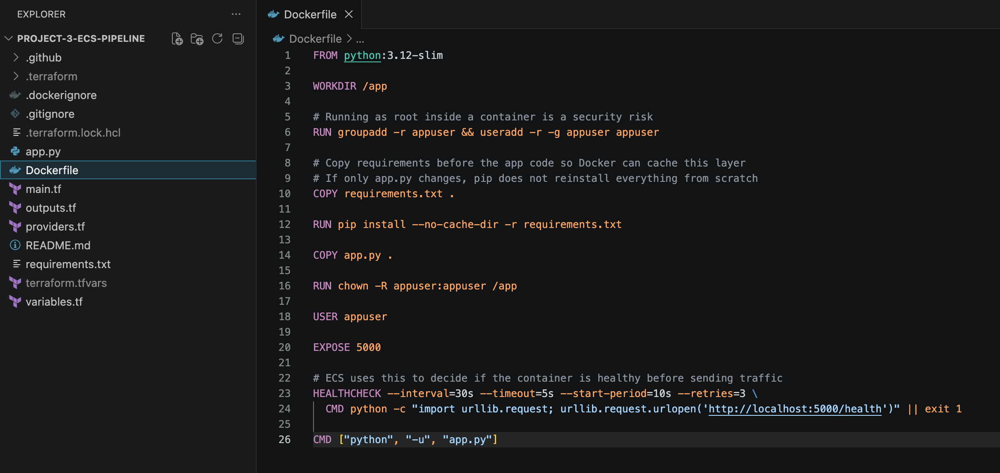
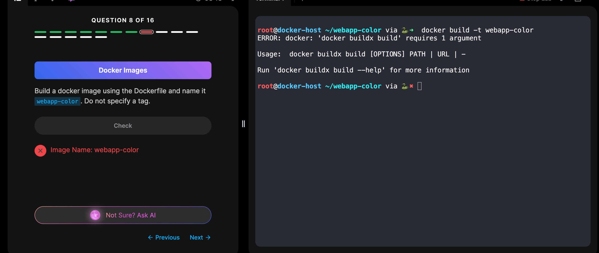
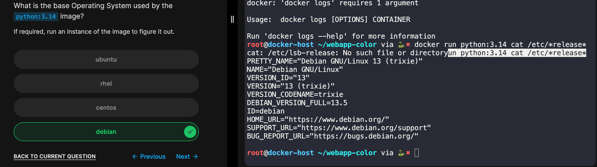

# Lab 03 — Docker Images

## What This Lab Covers

This lab covers how Docker images are actually built. Up until this point every image we ran was pulled from Docker Hub. Here we write our own Dockerfile, build an image from scratch, and understand how Docker processes each instruction. The lab also covers how Docker's build system evolved over time, which matters because understanding why things changed tells you a lot about how to use the current tools correctly.

This lab covers Dockerfiles, the FROM, RUN, COPY, ENV, and ENTRYPOINT instructions, layered image architecture, `docker build`, `docker push`, `docker history`, and an introduction to BuildKit.

---

## How a Dockerfile Works

A Dockerfile is a plain text file containing step by step instructions for building a Docker image. Docker reads it top to bottom and executes each instruction in order. Each instruction adds a new layer on top of the previous one.

The easiest way to write a Dockerfile is to think about what you would do to set up the application by hand on a fresh server, then write those steps down in order.

**Layered architecture**

Every instruction in a Dockerfile creates a layer. A layer only stores what changed from the previous one, not the full image each time. This is what makes Docker images efficient to store and fast to rebuild. If you change one line of your source code and rebuild, Docker only reruns the layers after the change. Everything before it is pulled from cache. The further up the Dockerfile an instruction lives, the less often it needs to rebuild.

You can see all the layers in an image and how large each one is by running:

    docker history my-app:1.0

---

## Dockerfile Instructions

**FROM**

Every Dockerfile must start with FROM. It defines the base image everything else is built on top of. This can be a full operating system or a language runtime.

    FROM python:3.14-slim

A few things worth knowing about choosing a base image. First, always pin to a specific version rather than using latest. Latest is a moving target and can produce a different image on your next build without you changing anything. Second, look for slim or alpine variants before defaulting to a full image. A full Ubuntu image is around 120MB before you have installed anything. A slim Python image already has Python built in and comes in at a fraction of that size. In most cases the slim variant has everything a containerized application actually needs.

The course example uses `FROM ubuntu` and then manually installs Python and Flask on top of it. That works, but it results in a much larger image and more steps than necessary. Starting from an image that already has your language runtime is the more practical approach.

**RUN**

RUN executes a shell command during the build. Use it to install packages or run anything that needs to be set up before the image is ready.

When installing packages, chain your commands together in a single RUN instruction rather than splitting them across multiple lines.

    RUN apt-get update && apt-get install -y python3

Writing them as two separate RUN instructions creates two layers when one is enough, and it can cause the package list to go stale between steps.

For Python packages specifically, use pip rather than apt. The apt version of a package like Flask may be outdated. Pip gives you the version you actually want.

    RUN pip install flask==3.0.3

**COPY**

COPY moves files from your local machine into the image. Source path first, destination path inside the image second.

    COPY app.py /opt/app.py

**ENV**

ENV sets an environment variable that will be available inside every container started from this image.

    ENV FLASK_APP=/opt/app.py

**ENTRYPOINT**

ENTRYPOINT defines the command that runs when the container starts.

    ENTRYPOINT ["flask", "run"]

---

## A Real Example Of A Dockerfile

This is the Dockerfile I wrote for Project 3 of my cloud engineering portfolio — a containerized Flask microservice deployed to AWS ECS Fargate with a GitHub Actions CI/CD pipeline and Terraform. It reflects the same concepts covered in this lab applied to an actual project, and goes further in a few areas the course does not cover, including running as a non-root user, smart layer ordering for faster rebuilds, and a health check that ECS uses to decide whether the container is ready to receive traffic.

[View Project 3: Containerized Microservice with Automated CI/CD Pipeline on GitHub!](https://github.com/brianne-y/aws-cicd-pipeline)

---

## Commands Covered

**`docker build`**

`docker build` reads a Dockerfile and builds an image from it. The `.` at the end tells Docker where to look for the files referenced in the Dockerfile. This is called the build context. It is not optional.

    docker build -t my-app:1.0 .

The `-t` flag tags the image with a name and version. Without it Docker assigns an ID with no readable name.

The `-f` flag points to a Dockerfile that is not named Dockerfile.

    docker build -t my-app:1.0 -f Dockerfile.dev .

The `--no-cache` flag forces every step to run from scratch, ignoring cached layers.

    docker build --no-cache -t my-app:1.0 .

---

**`docker push`**

`docker push` uploads a locally built image to a registry. The image name must follow the format `username/image-name:tag` to match your registry account.

    docker push mmshad/my-custom-app

---

**`docker history`**

`docker history` shows every layer in an image, the instruction that created it, and its size. Useful for understanding where image size is coming from and debugging unexpected build behavior.

    docker history my-app:1.0

---

## How Docker Build Evolved

The original Docker build engine worked well enough for simple projects but had four problems that surfaced quickly in real team environments.

**The Four Problems with Traditional Builds**

**1. Packages downloaded from scratch on every build.** Package managers like apt and pip downloaded everything from the internet on each build and then threw the cache away when the layer finished. Changing one line of source code meant waiting for all the same packages to download again every single time.

**2. Secrets leaking into image metadata.** When a build needed a credential like an API key or private token, there was no safe way to pass it in. Passing it as a build argument baked it permanently into the image's metadata. Setting it with ENV baked it into a layer visible to every process in every container. Copying a secret file in and deleting it later did not help because Docker layers are additive. The copy layer still exists inside the image even after a later deletion removes it from view. Anyone with the image could extract the secret from the layer directly. Every approach either leaked it openly or leaked it in a less obvious way.

**3. Architecture lock in.** Building on an Intel machine produced an AMD64 image. Building on Apple Silicon produced an ARM64 image. If your production server ran the opposite architecture, the image did not run on it.

**4. Independent stages running one after the other.** If a Dockerfile had two stages that did not depend on each other, the traditional builder ran them sequentially anyway even though there was no reason they could not run at the same time.

**The Modernized Solution: BuildKit: The Rewritten Build Engine**

Docker rewrote the build engine from scratch and called it BuildKit. As of Docker 23.0 released in January 2023, BuildKit is the default. Every `docker build` command you run today is already using it. The command line interface for its advanced features is called BuildX.

BuildKit addresses each of the four problems directly.

**Cache mounts** solve the problem of packages downloading from scratch. Adding a cache mount inside a RUN instruction tells BuildKit to keep the package manager's download cache between builds. The first build downloads everything normally. Every build after that pulls from local cache instead of the network.

**Secret mounts** solve the credential leakage problem. Instead of passing a secret as a build argument or copying it as a file, BuildKit mounts it into a single RUN step for the duration of that one command only. When the step finishes the secret is unmounted. It never gets written into any layer, never shows up in `docker history`, and never shows up in `docker inspect`. This is the most important reason to be using BuildKit if your build touches private resources.

**Multi platform builds** solve the architecture lock in problem. One `docker buildx build` command can produce images for multiple architectures and push them to a registry under a single name. Docker automatically pulls the right variant for whatever machine runs it. This is why most images on Docker Hub just work on Apple Silicon without any extra effort.

**Parallel stage execution** solves the sequential stages problem. BuildKit looks at the full Dockerfile before building, figures out which stages depend on each other and which do not, and runs the independent ones at the same time. No changes to the Dockerfile required.

---

## AWS Connection

**ECR and `docker push`.** In a production AWS environment, images are pushed to Amazon ECR instead of Docker Hub. The command is the same but the image name includes the ECR registry URL. This is covered directly in Lab 08.

**Base image size and ECS performance.** In ECS, a smaller image means faster pulls when a new task starts. Choosing a slim or alpine base image instead of a full OS image affects how quickly your containers come up, which matters most during scaling events and deployments.

**BuildKit in AWS CI pipelines.** Cache mounts and secret mounts are directly relevant in AWS CodeBuild and GitHub Actions. Without cache mounts, every pipeline run downloads all dependencies from scratch. Without secret mounts, teams risk leaking credentials into their ECR images, which is a serious security issue in any production environment.

---

## Troubleshooting

**I ran `docker build` without the `.` and got an error immediately**

I ran `docker build -t webapp-color` and Docker returned an error before doing anything. The `.` at the end of a build command tells Docker where to find the files the Dockerfile references. Without it Docker has no build context and refuses to run. It always goes at the end of the command.

    docker build -t webapp-color .

---

## Key Observations

- Writing a Dockerfile started to click when I stopped thinking of it as a config file and started thinking of it as the steps I would follow to set up the application by hand on a fresh machine. The order of those steps matters for the same reason it matters in real life.

- The layered architecture being cache aware changed how I think about Dockerfile structure. Instructions that change rarely, like installing system packages, belong near the top. Instructions that change often, like copying source code, belong near the bottom. That order is not just convention, it is what makes rebuilds fast.

- The secrets history was the most eye opening part of this section. It was not obvious to me that deleting a file in a later layer does not actually remove it from the image. Understanding that Docker layers are permanent and additive changes how seriously you have to think about what goes into a build.

- BuildKit is already running. There is nothing to install or enable. The fact that the tool I have been using all along is already the fixed version makes the historical context more useful, not less. When I read about build arguments or ENV being used for secrets somewhere online, I now know that is the old approach and I know why it is dangerous.

- When the lab asked me to identify the base OS of the `python:3.14` image, I did not know how to find that without looking it up. I ran `docker run python:3.14 cat /etc/*release*` which starts a temporary container from the image, reads the OS release file inside it, prints the result, and exits. The output showed it runs on Debian GNU/Linux 13. This is now my go-to for checking what OS any image is built on when the documentation does not make it obvious.

